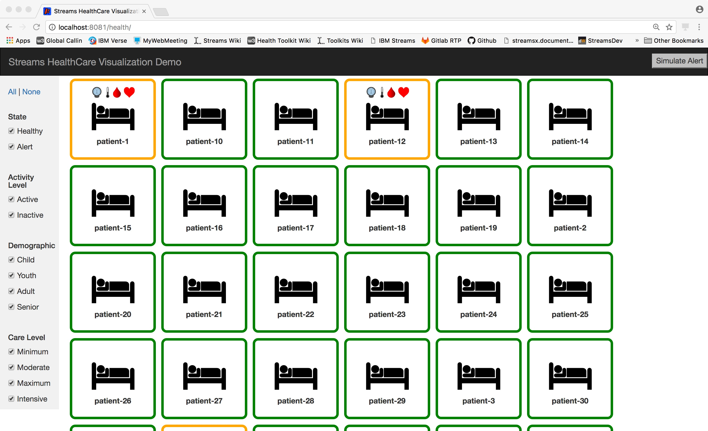

# Patients Monitoring Demo

This sample demonstrates how we can use IBM Streams and the Streams Healthcare Anallytics Platform to monitor patient status in real-time.  The sample generates vitals and ECG data for 100 patients.  Patient data is fed into an analytics application that checks if a patient's vitals are in the normal range.  If the vitals exceed the normal ranges, an alert is raised and is displayed on the dashboard.

The rules for checking the vitals and raising alerts are written in business rules using Operation Decision Manager (ODM).  The rules are then compiled into an SPL application.  To see the rules projects, refer to the PatientsMonitoringDemo.rules directory.



# Dependencies

This sample depends on the following microservices and toolkits:
* com.ibm.streamsx.health.ingest
* com.ibm.streamsx.health.sample.patientmonitoring.rules
* com.ibm.streamsx.inet - version 2.7.0 and above
* com.ibm.streamsx.json
* com.ibm.streamsx.messaging
* com.ibm.streamsx.topology
* com.ibm.streams.rulescompiler

# Build 

To build this sample, it is expected that your environment is set up to use the Java Application API from the com.ibm.streamsx.topology project.

The following environment variables need to be set.  The sample will work with Streams 4.2.0.0 and up:

* STREAMS_SPLPATH=/opt/ibm/InfoSphere_Streams/4.2.0.0/toolkits
* STREAMS_INSTALL=/opt/ibm/InfoSphere_Streams/4.2.0.0
* STREAMS_DOMAIN_ID=StreamsDomain
* STREAMS_INSTANCE_ID=StreamsInstance

To build:

```
git clone https://github.com/IBMStreams/streamsx.health.git
cd streamsx.health
./gradlew build
```

This will take a few minutes for the Healtcare Streaming Platform to build.

# Configure

Demo configuration can be found in the demo.properties file.  By default, the demo launches the HealthDataBeacon service and will generate data for 20 patients.

If you would like the demo to ingest data from another data source, you can specify additional topics using the `topic` proprties in the demo.properties file.

If you would like to suppress the launching of the HealthDataBeacon service, specify 0 in the num.patients property in the demo.properties file.

# Execute

To run the sample:

```
cd streamsx.health/samples/PatientsMonitoringDemo
../../gradlew execute
```

This will take a few minutes as when run the Java Topology applications, compile additional applications and submit the applications onto the streams instance as specified by the STREAMS_INSTANCE_ID environment variable.

If the job submissions are successful, you will see the following jobs submitted:

* com.ibm.streamsx.health.demo.service::UIservice
* com.ibm.streamsx.health.demo.service::PatientManipulatorService
* com.ibm.streamsx.health.demo.service::VitalsRulesServices

If the num.patients property is greater than zero, the following job will also be submitted.
* com.ibm.streamsx.health.simulate.beacon.service::HealthDataBeaconService

To see open the demo dashboard, open this URL in a browser:  http://localhost:8080/health

To generate alerts for patients, click on the Simulate Alert button at the top right corner.  To turn off the alerts, click on the Simulate Alert button again.

